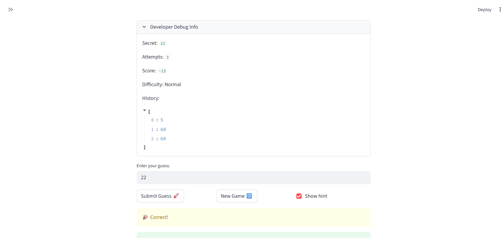

# 🎮 Game Glitch Investigator: The Impossible Guesser

## 🚨 The Situation

You asked an AI to build a simple "Number Guessing Game" using Streamlit.
It wrote the code, ran away, and now the game is unplayable. 

- You can't win.
- The hints lie to you.
- The secret number seems to have commitment issues.

## 🛠️ Setup

1. Install dependencies: `pip install -r requirements.txt`
2. Run the broken app: `python -m streamlit run app.py`

## 🕵️‍♂️ Your Mission

1. **Play the game.** Open the "Developer Debug Info" tab in the app to see the secret number. Try to win.
2. **Find the State Bug.** Why does the secret number change every time you click "Submit"? Ask ChatGPT: *"How do I keep a variable from resetting in Streamlit when I click a button?"*
3. **Fix the Logic.** The hints ("Higher/Lower") are wrong. Fix them.
4. **Refactor & Test.** - Move the logic into `logic_utils.py`.
   - Run `pytest` in your terminal.
   - Keep fixing until all tests pass!

## 📝 Document Your Experience

- [ X ] Describe the game's purpose.
The game is a guessing game with 3 modes: easy, normal, and hard. The user must guess a secret, winning number while staying within the range of numbers for their chosen difficulty. As the player guesses, the game offers feedback telling them whether their guess is too high, too low, or is the winning guess (equals the secret number).

- [ X ] Detail which bugs you found.
A few bugs I found included that starting a new game didn't refresh the player's guess history or hide the "game over" message and sets attempts to 1 rather than 0 by default on first load. I've listed a few more I identified and fixed in reflection.md

- [ X ] Explain what fixes you applied.
For the bugs described above, I updated lines to modify the part of state storing the player's guess history and modified logic around the game status stored in state to ensure the "game over" message would be hidden upon starting a new game. The default attempts was a small typo, and I simply set the inital value for attempts to 0.

## 📸 Demo

- [ X ] 

## 🚀 Stretch Features

- [ ] [If you choose to complete Challenge 4, insert a screenshot of your Enhanced Game UI here]
